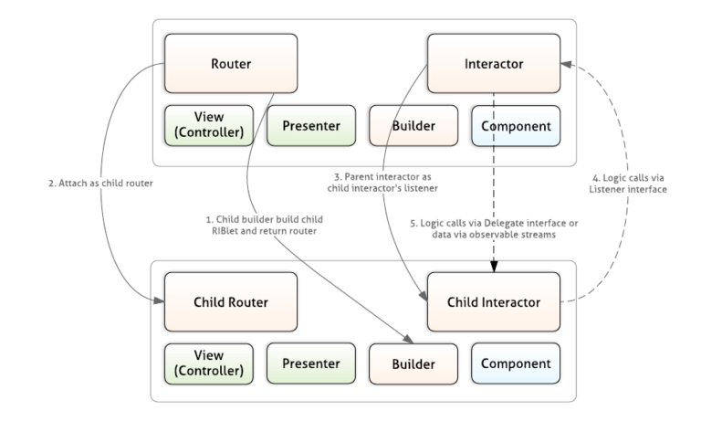

# Uber-architecture
## Introdução

O aplicativo Uber para motoristas é um sistema complexo e de alta escala, fundamental para o funcionamento da plataforma. Este trabalho prático visa analisar a arquitetura de software deste aplicativo, explorando suas tecnologias, evolução, requisitos e desafios.

## Caracterização do Sistema

### Requisitos do Sistema

*   **Nicho de Mercado:** Transporte privado urbano
*   **Número de Clientes:** Milhões de motoristas em todo o mundo
*   **Número de Acessos Simultâneos:** Potencialmente muito alto, especialmente em horários de pico
*   **Requisitos de Segurança:** Elevados, envolvendo dados pessoais, financeiros e de localização
*   **Requisitos de Confiabilidade:** Críticos, pois o aplicativo é a principal ferramenta de trabalho dos motoristas
*   **Requisitos de Escalabilidade:** Essenciais, devido ao rápido crescimento da plataforma
*   **Requisitos de Performance:** Importantes para garantir uma experiência fluida e responsiva

### Dados da Empresa

| Indústria               | Tecnologia      |
| --------------------- | ------------- |
| **Fundação**            | Junho de 2010   |
| **Presença em cidades no mundo** | +10,5 mil     |
| **Presença em cidades no Brasil** | +500          |
| **Presença em países**    | 70             |
| **Funcionários no Brasil** | +1 mil         |
| **Motoristas/entregadores parceiros no mundo** | 6,5 milhões   |
| **Motoristas/entregadores parceiros no Brasil*** | 1 milhão     |
| **Usuários no mundo**      | 142 milhões    |
| **Usuários no Brasil**    | 30 milhões\*   |
| **Viagens/entregas por dia no mundo** | 26 milhões    |

## Evolução da Arquitetura: De MVC para Riblets

A arquitetura inicial do aplicativo seguia o padrão **MVC (Model-View-Controller)**, amplamente utilizado em desenvolvimento. No entanto, com o crescimento da plataforma e do código, o MVC se mostrou inadequado, com problemas como:

*   **Controllers de View Muito Grandes:** Dificultando a leitura, manutenção e teste do código.
*   **Processo de Atualização Frágil:** Devido à falta de abstração e à complexidade dos testes.

Em busca de uma solução, a equipe da Uber explorou o padrão **VIPER (View-Interactor-Presenter-Entity-Router)**, que oferecia maior abstração e testabilidade. Porém, o VIPER também apresentou limitações, como:

*   **Especificidade para iOS:** Dificultando a adaptação para Android.
*   **Lógica de Aplicação Orientada à Visualização:** Acoplando a lógica de negócio à árvore de visualização.

A solução final foi o desenvolvimento do **Riblets**, um padrão de arquitetura próprio da Uber, que combina os benefícios do VIPER com a flexibilidade e escalabilidade necessárias para a plataforma.

## Riblets: A Arquitetura do Aplicativo Uber para Motoristas

O Riblets é um padrão de arquitetura modular, onde a aplicação é estruturada como uma árvore de Riblets. Cada Riblet é responsável por uma parte específica da lógica de negócio ou da interface do usuário.

### Componentes de um Riblet

*   **Router:** Responsável por anexar e desanexar Riblets filhos, formando a árvore da aplicação.
*   **Interactor:** Contém a lógica de negócio do Riblet.
*   **Builder:** Instancia os Riblets primários e define suas dependências.
*   **Component:** Obtém e instancia as dependências de um Riblet.
*   **Presenter (opcional):** Gerencia a comunicação entre o Interactor e a View.
*   **View (opcional):** Constrói e atualiza a interface do usuário.

### Características do Riblets

*   **Encaminhamento Guiado pela Lógica de Negócio:** A aplicação é orientada pelo fluxo da informação, não pela visualização.
*   **Agnóstico de Plataformas:** Facilita o desenvolvimento para iOS e Android.
*   **Separação Clara de Responsabilidades:** Melhora a testabilidade e a manutenção do código.
*   **Flexibilidade e Escalabilidade:** Permite adicionar e remover funcionalidades facilmente.

## Conclusão

A arquitetura Riblets permitiu que a Uber superasse os desafios de escalabilidade e complexidade do aplicativo para motoristas. A modularidade, a separação de responsabilidades e a orientação pela lógica de negócio são os pilares dessa arquitetura, que se mostrou fundamental para o sucesso da plataforma.

## Referências

*   **Engineering the Architecture Behind Uber's New Rider App:** https://www.uber.com/blog/new-rider-app-architecture/
*   **Engenharia da arquitetura por trás do novo aplicativo do motorista Uber:** https://imasters.com.br/android/engenharia-da-arquitetura-por-tras-do-novo-aplicativo-do-motorista-uber
*   **Fatos e Dados sobre a Uber:** https://www.uber.com/pt-BR/newsroom/fatos-e-dados-sobre-uber/